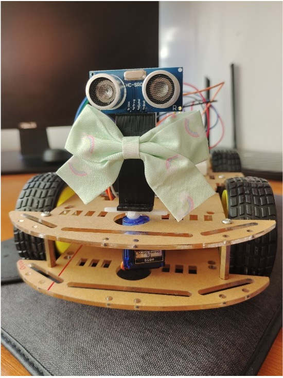

# Obstacle-Avoiding Robot Car (Arduino-Based)

---
This project presents a fully autonomous robot car built with Arduino Uno, capable of detecting and avoiding obstacles in real time. It demonstrates the integration of sensors and embedded systems to achieve intelligent navigation and decision-making in dynamic environments.

## Overview

The robot uses an ultrasonic sensor mounted on a servo motor to scan its environment. When it detects an obstacle within 35 cm, it stops, steps back, and scans left and right to find the clearest path forward — then turns in that direction.

---

## Hardware Components

- **Arduino Uno** – The brain of the robot
- **4x DC Motors** – For movement
- **L298N Motor Driver Module** – Controls the motors
- **HC-SR04 Ultrasonic Sensor** – Detects obstacles
- **Servo Motor** – Rotates the ultrasonic sensor to scan directions
- **9V Battery** – Powers the system
- **Wheels, wires, push button, chassis**

---

## How It Works

- The robot constantly checks for obstacles using the ultrasonic sensor.
- When an object is closer than 35 cm, it:
  - Stops
  - Moves backward slightly
  - Scans left and right using the servo motor
  - Turns toward the direction with more free space
- A push button toggles the robot's power state.

---
## Flowchart

Below is the logic used for decision-making when the robot encounters obstacles:

---
## Software

The code was written in **Arduino IDE** and includes:

- Pin configuration for all components
- Debounce logic for the button input
- Functions for movement and obstacle handling
- Servo logic for directional scanning

---

## Media

---
## Contact

For more details or collaboration:
- Email: carlabarastean@gmail.com
- LinkedIn: [linkedin.com/in/carla-barastean-621326269](https://www.linkedin.com/in/carla-barastean-621326269)

Thank you for visiting this project!

